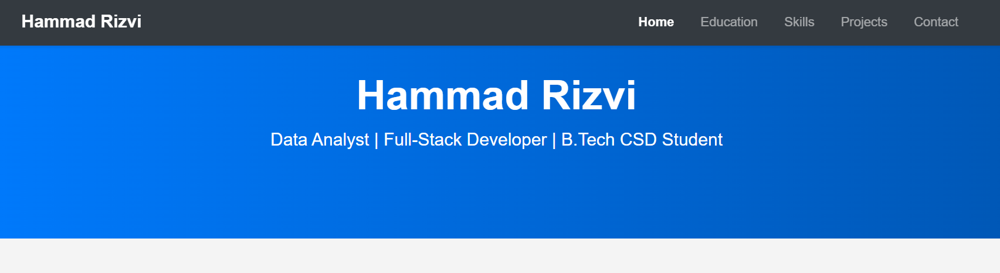

# Hammad Rizvi's Personal Portfolio

> Building skills in Data Science & Full-Stack | Lifelong learner | Passion: AI, Coding, Problem-Solving

---

## 🚀 Live Demo

### >> [hammadrizvi.me](https://hammadrizvi.me) <<

---

## 📸 Sneak Peek

---

## 🛠️ Tech Stack

| Technology | Purpose |
| :--- | :--- |
| **HTML5** | Structure and Content |
| **CSS3** | Styling and Design |
| **Bootstrap 5** | Responsive Layout & Components |
| **Font Awesome** | Icons |
| **Formspree** | Functional Contact Form |
| **GitHub Pages**| Hosting |

---

## 📖 About This Project

This is my personal portfolio, built from scratch to showcase my journey as a B.Tech student in Computer Science & Design. It's a living project that will grow as I learn new skills and build more applications. The goal is to have a professional space to present my work to peers, mentors, and potential recruiters.

---

## 📫 Get In Touch

* **LinkedIn**: [linkedin.com/in/hammadrizvi346](https://www.linkedin.com/in/hammadrizvi346)
* **Email**: hammadrizvi346@gmail.com